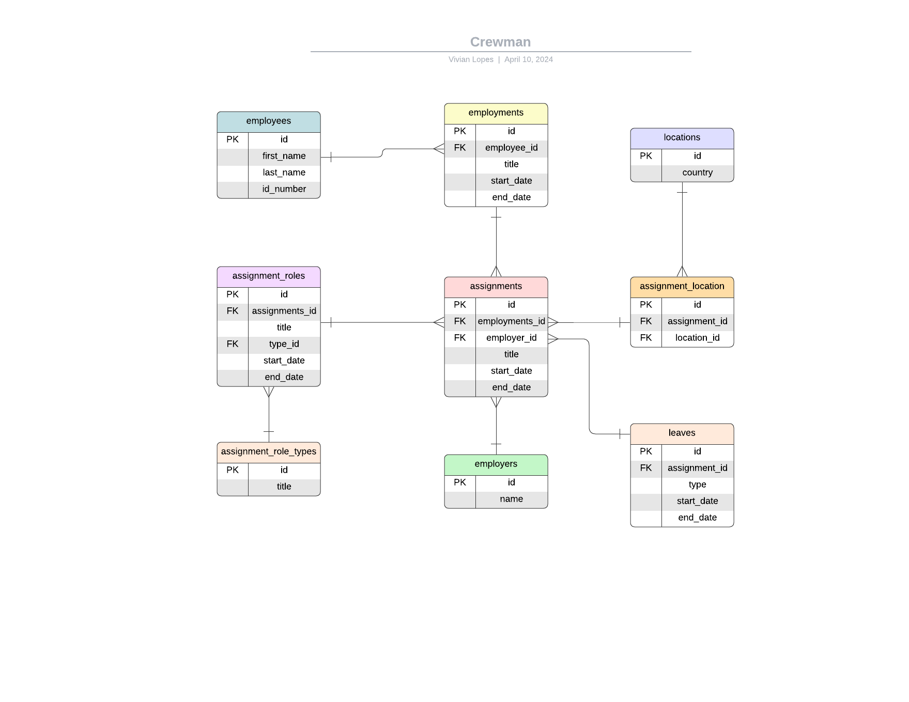

<h1 align="center">Crewman</h1>

## installation

- clone the project

## api folder
install dependencies with the command
> composer create-project
- setup the .env file

- containerize the project
>./vendor/bin/sail up
- run migrations and seeders
>./vendor/bin/sail artisan migrate --seed 

## client folder
- install dependencies
> npm install
- run client
> quasar dev

## ER-diagram

## testing
- setup the .env.testing file
- generate keys (if necessary) with the command 
> php artisan key:generate --env=testing
- run test migrations 
> ./vendor/bin/sail artisan migrate --env=testing
- run tests with the command 
> ./vendor/bin/pest

### Technologies utilized in my project 
 
 
 